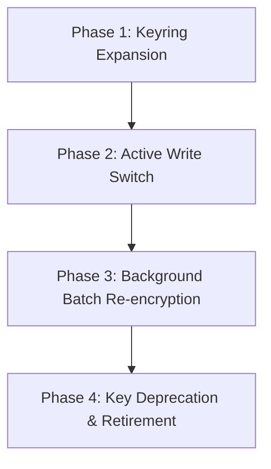

# Don's Atelier - Field-Level Encryption & Key Rotation Guide

## 1. Overview & Architecture

Don's Atelier uses **application-level AES-256-GCM authenticated encryption** for high-risk PII and sensitive bespoke tailoring data stored in Postgres:
- **Phone Numbers**: `profiles.phone`, `addresses.phone`
- **Customer Addresses**: `addresses` fields (`recipientName`, `line1`, `line2`, `city`, `state`, `postalCode`), and `orders.shippingAddress` (JSON snapshot at checkout)
- **Anatomical Measurements**: `measurements.value` (bespoke tailoring fit metrics)

### Cryptographic Parameters
- **Algorithm**: `AES-256-GCM` (NIST SP 800-38D)
- **Key Length**: 256 bits (32 bytes)
- **Initialization Vector (IV)**: 96 bits (12 bytes), generated via `crypto.randomBytes(12)` uniquely for every encryption operation. Never reused.
- **Authentication Tag**: 128 bits (16 bytes), verifying ciphertext authenticity and preventing ciphertext tampering or truncation.
- **Payload Format**:
  ```
  enc:<keyId>:<ivHex>:<authTagHex>:<ciphertextHex>
  ```
  *Example*: `enc:v1:7a8b9c0d1e2f3a4b5c6d7e8f:1a2b3c4d5e6f7a8b9c0d1e2f3a4b5c6d:4e5f6a...`

---

## 2. Key Provisioning & Configuration

Keys are stored in server environment variables and **never** exposed to client code or prefixed with `NEXT_PUBLIC_`.

### Environment Configuration
1. **Single Active Key**:
   ```bash
   FIELD_ENCRYPTION_KEY="64_HEX_CHARACTERS_OR_32_BYTE_BASE64_STRING"
   FIELD_ENCRYPTION_ACTIVE_KEY_ID="v1"
   ```
2. **Keyring for Multi-Key Rotation**:
   ```bash
   FIELD_ENCRYPTION_KEYS='{"v1":"<32-byte-hex-v1>","v2":"<32-byte-hex-v2>"}'
   FIELD_ENCRYPTION_ACTIVE_KEY_ID="v2"
   ```

To generate a new cryptographically secure 256-bit key:
```bash
openssl rand -hex 32
```

---

## 3. Zero-Downtime Key Rotation Lifecycle

When rotating keys (e.g., from version `v1` to `v2` as part of regular 90-day crypto-period rotation or credential replenishment), follow this 4-phase process:



### Phase 1: Keyring Expansion
Add the new key (`v2`) to `FIELD_ENCRYPTION_KEYS` while keeping `v1` as the active write key:
```bash
FIELD_ENCRYPTION_KEYS='{"v1":"<old-key-hex>","v2":"<new-key-hex>"}'
FIELD_ENCRYPTION_ACTIVE_KEY_ID="v1"
```
*Result*: The application can now read any record encrypted with `v1` or `v2`.

### Phase 2: Active Write Switch
Promote `v2` to be the primary encryption key:
```bash
FIELD_ENCRYPTION_ACTIVE_KEY_ID="v2"
```
*Result*: All new user signups, profile edits, checkout addresses, and bespoke measurements are immediately encrypted with `v2`. Existing records encrypted with `v1` continue to be decrypted seamlessly on read because `decryptField()` reads the key version from the payload prefix (`enc:v1:...`).

### Phase 3: Background Re-Encryption Migration
Run the automated migration script to re-encrypt legacy `v1` records to `v2`. The utility `rotateFieldEncryption(val, 'v2')` decrypts using `v1` and re-encrypts using `v2` with a fresh random IV:

```typescript
// scripts/rotate-encryption-keys.ts
import { prisma } from '@/lib/db/prisma';
import { rotateFieldEncryption, isEncrypted } from '@/lib/crypto/field-encryption';

async function rotateDatabaseKeys(targetKeyId: string = 'v2') {
  console.log(`Starting key rotation to version ${targetKeyId}...`);

  // 1. Rotate Profiles
  const profiles = await prisma.profile.findMany({ where: { phone: { not: null } } });
  for (const p of profiles) {
    if (p.phone && isEncrypted(p.phone)) {
      const rotated = rotateFieldEncryption(p.phone, targetKeyId);
      await prisma.profile.update({ where: { id: p.id }, data: { phone: rotated } });
    }
  }

  // 2. Rotate Custom Order Measurements
  const measurements = await prisma.measurement.findMany();
  for (const m of measurements) {
    if (isEncrypted(m.value)) {
      const rotated = rotateFieldEncryption(m.value, targetKeyId);
      await prisma.measurement.update({ where: { id: m.id }, data: { value: rotated } });
    }
  }

  // 3. Rotate Order Shipping Addresses
  const orders = await prisma.order.findMany();
  for (const o of orders) {
    const addr = o.shippingAddress as Record<string, unknown>;
    if (addr) {
      let changed = false;
      const updated: Record<string, unknown> = { ...addr };
      for (const [k, v] of Object.entries(updated)) {
        if (typeof v === 'string' && isEncrypted(v)) {
          updated[k] = rotateFieldEncryption(v, targetKeyId);
          changed = true;
        }
      }
      if (changed) {
        await prisma.order.update({ where: { id: o.id }, data: { shippingAddress: updated as any } });
      }
    }
  }

  console.log('Key rotation completed successfully.');
}
```

### Phase 4: Key Deprecation & Retirement
1. Query the database to ensure zero records remain prefixed with `enc:v1:`:
   ```sql
   SELECT count(*) FROM profiles WHERE phone LIKE 'enc:v1:%';
   SELECT count(*) FROM measurements WHERE value LIKE 'enc:v1:%';
   ```
2. Once the count is zero, safely remove `v1` from `FIELD_ENCRYPTION_KEYS`:
   ```bash
   FIELD_ENCRYPTION_KEY="<new-key-v2-hex>"
   FIELD_ENCRYPTION_ACTIVE_KEY_ID="v2"
   ```

---

## 4. Security Guarantees & Verification
- **Authenticated Integrity**: If any bit of ciphertext, IV, or authentication tag is modified in Postgres, AES-GCM tag verification fails and an immediate operational error is raised.
- **IND-CPA Security**: Because each encryption uses a cryptographically fresh 96-bit random IV, encrypting the identical phone number or measurement twice produces completely different ciphertexts, preventing frequency analysis and rainbow table correlation.
- **Graceful Legacy Fallback**: Records that do not start with `enc:` are recognized as legacy unencrypted values and returned as-is, ensuring zero downtime during system rollout.
